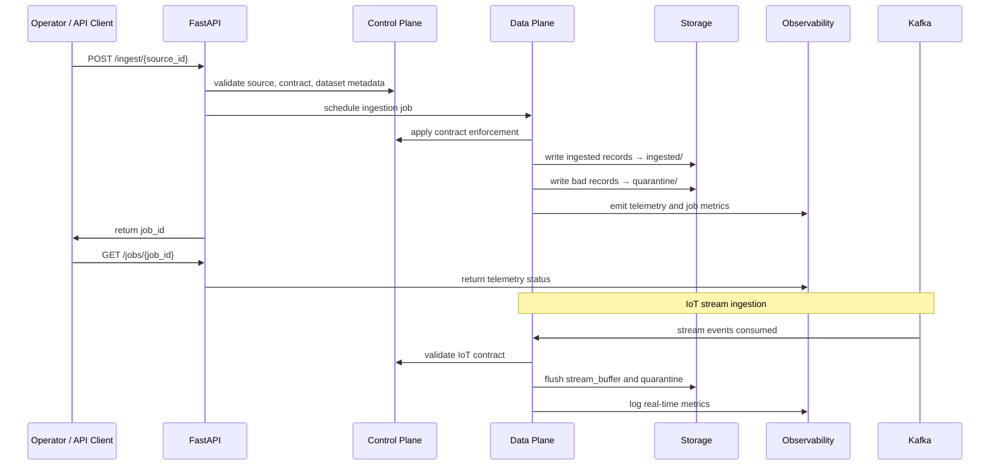

# Supply Chain Ingestion Architecture

This document captures the full architecture of the Supply Chain Ingestion Pipeline, including the control plane, data plane, observability plane, storage, external interfaces, and runtime flow.

## 1. System Architecture Overview

```mermaid
flowchart TD
    subgraph Sources
        A1[Warehouse Master CSV] -->|Raw file| DP1[Batch Ingestion]
        A2[Manufacturing Logs CSV] -->|Raw file| DP1
        A3[Sales History CSV] -->|Raw file| DP1
        A4[Legacy Trends CSV] -->|Raw file| DP1
        A5[Weather API] -->|Pull / API| DP1
        A6[IoT RFID Stream] -->|Kafka / Stream| DP2[Real-time Ingestion]
    end

    subgraph ControlPlane[Control Plane]
        CP1[DataSource Registry]\n(control_plane/entities.py)
        CP2[Dataset Registry]\n(control_plane/entities.py)
        CP3[Contracts / Policies]\n(control_plane/contracts.py)
    end

    subgraph DataPlane[Data Plane]
        DP1[Batch + Micro-batch Ingestion]\n(data_plane/ingestion)
        DP2[Real-time IoT Ingestion]\n(data_plane/ingestion/real_time_iot_ingest.py)
        DP3[CDC Trigger + Strategies]\n(data_plane/cdc)
        DP4[Generators]\n(data_plane/generators)
    end

    subgraph Storage[Storage Layer]
        S1[raw/] --> S2[ingested/]
        S1 --> S3[quarantine/]
        S1 --> S4[micro_batch/]
        S1 --> S5[stream_buffer/]
        S1 --> S6[cdc_log/]
        S1 --> S7[checkpoints/]
    end

    subgraph Observability[Observability Plane]
        O1[Telemetry + Job Metrics]\n(observability_plane/telemetry.py)
        O2[Logging / Health / Metrics]\n(api.py + run_all.py)
    end

    DP1 -->|Good records| S2
    DP1 -->|Invalid records| S3
    DP2 -->|Valid events| S5
    DP2 -->|Quarantined events| S3
    DP3 -->|CDC events| S6
    DP3 -->|CDC state| S7

    CP1 --> DP1
    CP2 --> DP1
    CP3 --> DP1
    CP3 --> DP2
    CP3 --> DP3
    CP1 --> DP3
    CP2 --> DP3

    O1 --> DP1
    O1 --> DP2
    O1 --> DP3
    O2 --> DP1
    O2 --> DP2
    O2 --> DP3

    subgraph API[API / Control Interface]
        API1[FastAPI server]\n(api.py)
        API2[Job orchestration]\n(background ingestion jobs)
        API3[Source / Dataset metadata]\n(GET /sources, GET /datasets)
        API4[Protected ingestion endpoint]\n(POST /ingest/{source_id})
    end

    API1 --> API2
    API3 --> CP1
    API3 --> CP2
    API1 -->|Triggers| DP1
    API1 -->|Job status| O1
    API1 -->|Health / metrics| O2

    API1 --> S2
    API1 --> S3

    API1 -->|API Traffic| Clients["Operators / Orchestration / CI"]
    Clients --> API1
    A6 -->|Kafka topic| Kafka[Kafka cluster]
    Kafka --> A6
    Kafka --> DP2
    API1 -->|Optional| Kafka

    style Sources fill:#f9f,stroke:#333,stroke-width:1px
    style ControlPlane fill:#ccf,stroke:#333,stroke-width:1px
    style DataPlane fill:#cfc,stroke:#333,stroke-width:1px
    style Storage fill:#ffc,stroke:#333,stroke-width:1px
    style Observability fill:#eef,stroke:#333,stroke-width:1px
    style API fill:#f2f2f2,stroke:#333,stroke-width:1px
```

## 2. Runtime Flow



## 3. Key Architecture Layers

- **Sources**: file-based CSV sources, external weather API, IoT Kafka stream.
- **Control Plane**: central metadata registry for sources, datasets, jobs, event envelopes, and contract/policy enforcement.
- **Data Plane**: ingestion logic for batch, micro-batch, CDC, and live streaming.
- **Storage**: raw landing zone, ingested zone, quarantine zone, CDC logs, stream buffers, and checkpoint state.
- **Observability Plane**: telemetry, file logs, health checks, metrics, and job-level reporting.

## 4. Deployment and Production Mode

- `run_all.py` executes the full seven-phase pipeline in simulation mode.
- `run_production.py` starts the API server and the IoT consumer in production-compatible mode.
- `docker-compose.yml` configures containerized runtime with API, Kafka, and supporting services.

## 5. Relevant Files

- `control_plane/entities.py`
- `control_plane/contracts.py`
- `data_plane/generators/source_generators.py`
- `data_plane/ingestion/batch_ingest.py`
- `data_plane/ingestion/iot_stream_ingest.py`
- `data_plane/ingestion/real_time_iot_ingest.py`
- `data_plane/cdc/cdc_trigger.py`
- `data_plane/cdc/cdc_strategies.py`
- `observability_plane/telemetry.py`
- `api.py`
- `run_all.py`
- `run_production.py`
