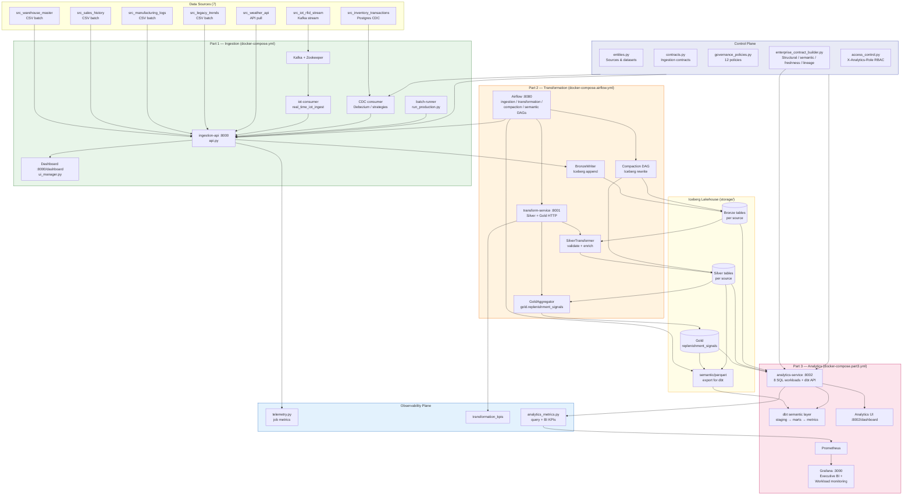
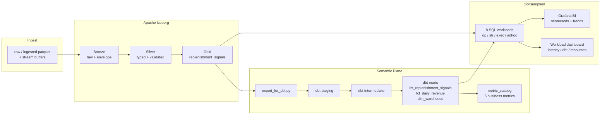
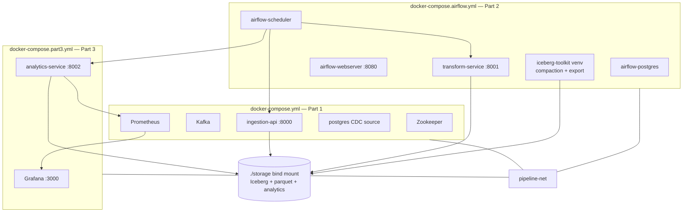
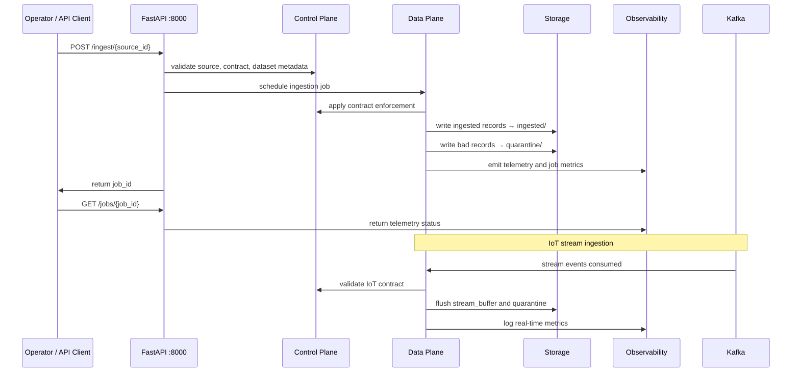
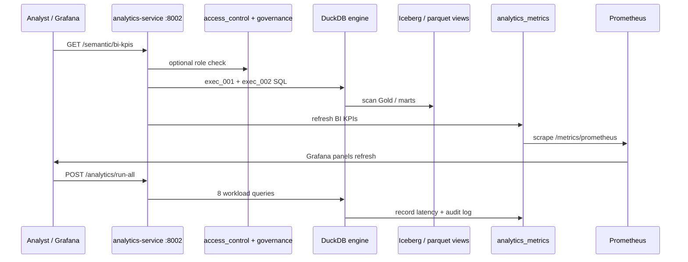

# Supply Chain Pipeline — End-to-End Architecture

**Use case (Parts 1–3):** Supply Chain Inventory Optimization — optimize stock levels, detect replenishment risk, and expose governed analytics for warehouse operations.

This document describes the **full platform**: ingestion (Part 1) → Iceberg lakehouse transformation (Part 2) → semantic analytics & BI (Part 3).

---

## End-to-End Architecture Overview

```mermaid
flowchart TB
    subgraph Sources["Data Sources (7)"]
        S1[src_warehouse_master\nCSV batch]
        S2[src_sales_history\nCSV batch]
        S3[src_manufacturing_logs\nCSV batch]
        S4[src_legacy_trends\nCSV batch]
        S5[src_weather_api\nAPI pull]
        S6[src_iot_rfid_stream\nKafka stream]
        S7[src_inventory_transactions\nPostgres CDC]
    end

    subgraph CP["Control Plane"]
        CP1[entities.py\nSources & datasets]
        CP2[contracts.py\nIngestion contracts]
        CP3[governance_policies.py\n12 policies]
        CP4[enterprise_contract_builder.py\nStructural / semantic / freshness / lineage]
        CP5[access_control.py\nX-Analytics-Role RBAC]
    end

    subgraph P1["Part 1 — Ingestion (docker-compose.yml)"]
        API[ingestion-api :8000\napi.py]
        KAFKA[Kafka + Zookeeper]
        CDC[CDC consumer\nDebezium / strategies]
        IOT[iot-consumer\nreal_time_iot_ingest]
        BATCH[batch-runner\nrun_production.py]
        UI1[Dashboard :8000/dashboard\nui_manager.py]
    end

    subgraph P2["Part 2 — Transformation (docker-compose.airflow.yml)"]
        AF[Airflow :8080\ningestion / transformation /\ncompaction / semantic DAGs]
        TX[transform-service :8001\nSilver + Gold HTTP]
        BRONZE[BronzeWriter\nIceberg append]
        SILVER[SilverTransformer\nvalidate + enrich]
        GOLD[GoldAggregator\ngold.replenishment_signals]
        COMPACT[Compaction DAG\nIceberg rewrite]
    end

    subgraph Lake["Iceberg Lakehouse (storage/)"]
        IB[(Bronze tables\nper source)]
        IS[(Silver tables\nper source)]
        IG[(Gold\nreplenishment_signals)]
        PQ[semantic/parquet\nexport for dbt]
    end

    subgraph P3["Part 3 — Analytics (docker-compose.part3.yml)"]
        AN[analytics-service :8002\n8 SQL workloads + dbt API]
        DBT[dbt semantic layer\nstaging → marts → metrics]
        UI2[Analytics UI :8002/dashboard]
        PROM[Prometheus]
        GRAF[Grafana :3000\nExecutive BI +\nWorkload monitoring]
    end

    subgraph OBS["Observability Plane"]
        TEL[telemetry.py\njob metrics]
        TKPI[transformation_kpis]
        AM[analytics_metrics.py\nquery + BI KPIs]
    end

    CP --> API
    CP --> CDC
    CP --> AN
    CP4 --> AN

    S1 & S2 & S3 & S4 & S5 --> API
    S6 --> KAFKA --> IOT --> API
    S7 --> CDC --> API

    API --> BRONZE
    BATCH --> API
    AF --> API
    AF --> TX

    BRONZE --> IB
    IB --> SILVER --> IS
    IS --> GOLD --> IG
    TX --> SILVER
    TX --> GOLD
    COMPACT --> IS
    COMPACT --> IB

    AF --> COMPACT
    AF --> PQ
    IG --> PQ
    IS --> PQ

    PQ --> DBT
    AN --> DBT
    IG --> AN
    IS --> AN
    IB --> AN

    AN --> UI2
    AN --> AM --> PROM --> GRAF
    API --> TEL
    TX --> TKPI
    API --> UI1

    style CP fill:#e8eaf6,stroke:#3949ab
    style P1 fill:#e8f5e9,stroke:#2e7d32
    style P2 fill:#fff3e0,stroke:#ef6c00
    style P3 fill:#fce4ec,stroke:#c2185b
    style Lake fill:#fffde7,stroke:#f9a825
    style OBS fill:#e3f2fd,stroke:#1565c0
```

---

## Data Flow (Medallion + Semantic)

```mermaid
flowchart LR
    subgraph Ingest
        RAW[raw / ingested parquet\n+ stream buffers]
    end

    subgraph Medallion["Apache Iceberg"]
        B[Bronze\nraw + envelope]
        S[Silver\ntyped + validated]
        G[Gold\nreplenishment_signals]
    end

    subgraph Semantic["Semantic Plane"]
        E[export_for_dbt.py]
        STG[dbt staging]
        INT[dbt intermediate]
        MRT[dbt marts\nfct_replenishment_signals\nfct_daily_revenue\ndim_warehouse]
        MET[metric_catalog\n5 business metrics]
    end

    subgraph Consume["Consumption"]
        SQL[8 SQL workloads\nop / str / exec / adhoc]
        BI[Grafana BI\nscorecards + trends]
        MON[Workload dashboard\nlatency / dbt / resources]
    end

    RAW --> B --> S --> G
    G --> E --> STG --> INT --> MRT --> MET
    G --> SQL
    MRT --> SQL
    SQL --> BI
    SQL --> MON
```

---

## Four-Plane Model (Part 3)

| Plane | Responsibility | Key paths |
|-------|------------------|-----------|
| **Control** | Governance, ingestion + enterprise contracts, RBAC | `control_plane/` |
| **Data** | Ingestion, CDC, transformation, SQL analytics | `data_plane/`, `storage_plane/` |
| **Semantic** | dbt models, metrics, lineage, parquet export | `semantic_plane/` |
| **Observability** | Telemetry, transformation KPIs, query/BI metrics, Grafana | `observability_plane/`, `monitoring/` |

**RBAC:** Part 3 analytics SQL workloads use `X-Analytics-Role` (`admin`, `analyst`, `finance`, `ops_streaming`). Full layer × persona matrix → [`docs/part3/RBAC_ACCESS_MATRIX.md`](docs/part3/RBAC_ACCESS_MATRIX.md).

---

## Docker Deployment Topology

Three Compose stacks share the external network **`pipeline-net`** and bind-mount **`./storage`**.

```mermaid
flowchart TB
    subgraph DC1["docker-compose.yml — Part 1"]
        ZK[Zookeeper]
        KF[Kafka]
        ING[ingestion-api :8000]
        PG1[postgres CDC source]
        PR1[Prometheus]
    end

    subgraph DC2["docker-compose.airflow.yml — Part 2"]
        PG2[airflow-postgres]
        AFS[airflow-scheduler]
        AFW[airflow-webserver :8080]
        TR[transform-service :8001]
        ITK[iceberg-toolkit venv\ncompaction + export]
    end

    subgraph DC3["docker-compose.part3.yml — Part 3"]
        AN2[analytics-service :8002]
        GF[Grafana :3000]
    end

    ST[(./storage bind mount\nIceberg + parquet + analytics)]

    ING --> ST
    TR --> ST
    ITK --> ST
    AN2 --> ST
    AFS --> ING
    AFS --> TR
    AFS --> AN2
    AN2 --> PR1
    PR1 --> GF

    DC1 --- pipeline-net
    DC2 --- pipeline-net
    DC3 --- pipeline-net
```

**Start order:** Part 1 → Part 2 → Part 3.

---

## Orchestration (Airflow DAGs)

| DAG | Purpose |
|-----|---------|
| `supply_chain_ingestion` | Trigger batch / streaming ingestion via API |
| `supply_chain_transformation` | Bronze → Silver → Gold via transform-service |
| `supply_chain_iceberg_compaction` | Rewrite small Iceberg files (Silver/Bronze/Gold) |
| `supply_chain_semantic` | Export parquet → dbt run/test → SQL workloads on analytics-service |

---

## User-Facing Interfaces

| URL | Component | Scope |
|-----|-----------|--------|
| http://localhost:8000/dashboard | Ingestion dashboard | Part 1–2 pipeline health, charts |
| http://localhost:8080 | Airflow UI | DAG runs, logs |
| http://localhost:8001/docs | transform-service | Silver/Gold transform API |
| http://localhost:8002/dashboard | Analytics UI | Part 3 KPIs, SQL catalog, run-all |
| http://localhost:8002/docs | analytics-service | Governance, contracts, queries, dbt |
| http://localhost:3000 | Grafana | Executive BI + workload monitoring |

---

## Part 1 — Ingestion Architecture (detail)

```mermaid
flowchart TD
    subgraph Sources
        A1[Warehouse Master CSV] -->|Raw file| DP1[Batch Ingestion]
        A2[Manufacturing Logs CSV] -->|Raw file| DP1
        A3[Sales History CSV] -->|Raw file| DP1
        A4[Legacy Trends CSV] -->|Raw file| DP1
        A5[Weather API] -->|Pull / API| DP1
        A6[IoT RFID Stream] -->|Kafka / Stream| DP2[Real-time Ingestion]
    end

    subgraph ControlPlane[Control Plane]
        CP1[DataSource Registry\ncontrol_plane/entities.py]
        CP2[Dataset Registry\ncontrol_plane/entities.py]
        CP3[Contracts / Policies\ncontrol_plane/contracts.py]
    end

    subgraph DataPlane[Data Plane]
        DP1[Batch + Micro-batch Ingestion\ndata_plane/ingestion]
        DP2[Real-time IoT Ingestion\ndata_plane/ingestion/real_time_iot_ingest.py]
        DP3[CDC Trigger + Strategies\ndata_plane/cdc]
        DP4[Generators\ndata_plane/generators]
    end

    subgraph Storage[File Storage Layer]
        S1[raw/] --> S2[ingested/]
        S1 --> S3[quarantine/]
        S1 --> S4[micro_batch/]
        S1 --> S5[stream_buffer/]
        S1 --> S6[cdc_log/]
        S1 --> S7[checkpoints/]
    end

    subgraph Observability[Observability Plane]
        O1[Telemetry + Job Metrics\nobservability_plane/telemetry.py]
        O2[Logging / Health / Metrics\napi.py + run_all.py]
    end

    DP1 -->|Good records| S2
    DP1 -->|Invalid records| S3
    DP2 -->|Valid events| S5
    DP2 -->|Quarantined events| S3
    DP3 -->|CDC events| S6
    DP3 -->|CDC state| S7

    CP1 --> DP1
    CP2 --> DP1
    CP3 --> DP1
    CP3 --> DP2
    CP3 --> DP3

    O1 --> DP1
    O1 --> DP2
    O1 --> DP3
    O2 --> DP1
    O2 --> DP2
    O2 --> DP3

    subgraph API[API / Control Interface]
        API1[FastAPI server\napi.py]
        API2[Job orchestration]
        API3[Source / Dataset metadata]
        API4[POST /ingest/source_id]
    end

    API1 --> API2
    API3 --> CP1
    API3 --> CP2
    API1 -->|Triggers| DP1
    API1 -->|Job status| O1
    API1 -->|Health / metrics| O2
    API1 --> S2
    API1 --> S3
    API1 -->|API Traffic| Clients[Operators / Orchestration]
    Clients --> API1
    A6 -->|Kafka topic| Kafka[Kafka cluster]
    Kafka --> DP2
```

---

## Ingestion Runtime Sequence

```mermaid
sequenceDiagram
    participant User as Operator / API Client
    participant API as FastAPI :8000
    participant CP as Control Plane
    participant DP as Data Plane
    participant ST as Storage
    participant OB as Observability
    participant Kafka as Kafka

    User->>API: POST /ingest/{source_id}
    API->>CP: validate source, contract, dataset metadata
    API->>DP: schedule ingestion job
    DP->>CP: apply contract enforcement
    DP->>ST: write ingested records → ingested/
    DP->>ST: write bad records → quarantine/
    DP->>OB: emit telemetry and job metrics
    API->>User: return job_id
    User->>API: GET /jobs/{job_id}
    API->>OB: return telemetry status

    note over Kafka,DP: IoT stream ingestion
    Kafka->>DP: stream events consumed
    DP->>CP: validate IoT contract
    DP->>ST: flush stream_buffer and quarantine
    DP->>OB: log real-time metrics
```

---

## Part 3 — Analytics Request Path

```mermaid
sequenceDiagram
    participant User as Analyst / Grafana
    participant AN as analytics-service :8002
    participant CP as access_control + governance
    participant DDB as DuckDB engine
    participant ICE as Iceberg / parquet views
    participant MET as analytics_metrics
    participant PR as Prometheus

    User->>AN: GET /semantic/bi-kpis
    AN->>CP: optional role check
    AN->>DDB: exec_001 + exec_002 SQL
    DDB->>ICE: scan Gold / marts
    AN->>MET: refresh BI KPIs
    MET->>PR: scrape /metrics/prometheus
    PR->>User: Grafana panels refresh

    User->>AN: POST /analytics/run-all
    AN->>DDB: 8 workload queries
    DDB->>MET: record latency + audit log
```

---

## Key Files by Phase

| Phase | Files |
|-------|--------|
| **Part 1** | `control_plane/entities.py`, `control_plane/contracts.py`, `data_plane/ingestion/`, `data_plane/cdc/`, `api.py`, `run_all.py` |
| **Part 2** | `data_plane/transformation/`, `storage_plane/iceberg_catalog.py`, `airflow/dags/transformation_dag.py`, `transform_service.py` |
| **Part 3** | `control_plane/governance_policies.py`, `control_plane/enterprise_contract_builder.py`, `data_plane/analytics/`, `semantic_plane/dbt/`, `analytics_service.py`, `observability_plane/analytics_metrics.py` |
| **Docs** | `PROJECT_PART3_REPORT.md`, `PART3_EXECUTION_GUIDE.md`, `Data_Engineering_Project_Report.md` |

---

## Deployment Modes

| Mode | Entry point |
|------|-------------|
| Local simulation | `python run_all.py` |
| Production ingestion | `docker compose up` + `run_production.py` / batch-runner |
| Full lakehouse + BI | Three compose files + Airflow DAGs (see `PART3_EXECUTION_GUIDE.md`) |
