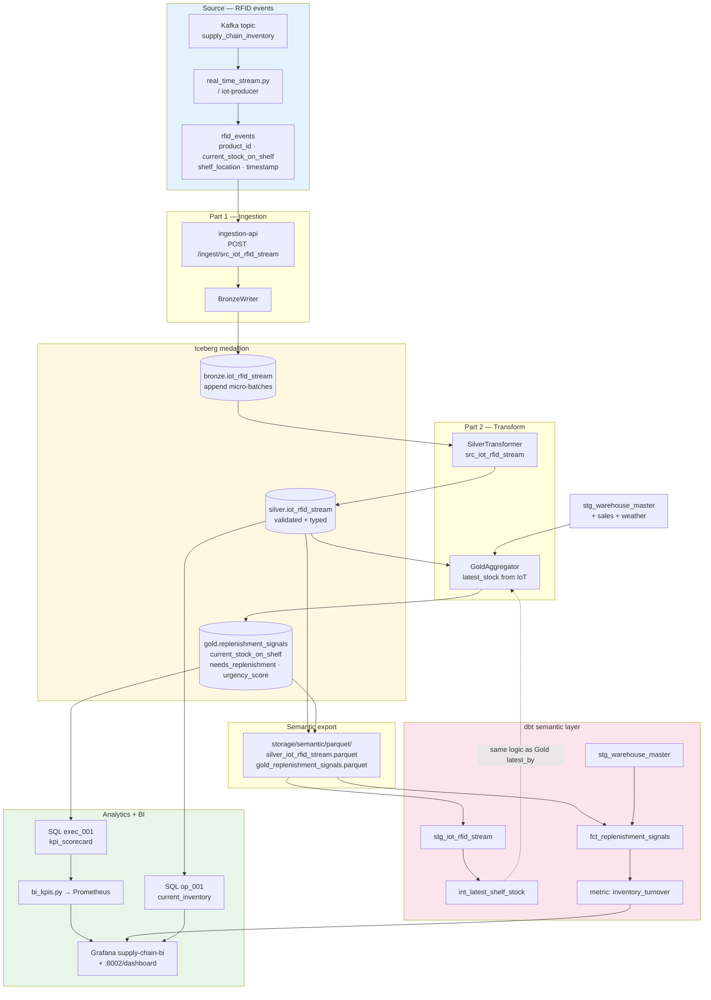
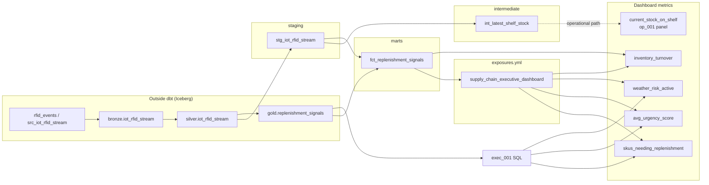

# dbt Lineage — RFID Events → Bronze → Silver → Gold → Dashboard Metrics

**Canonical source ID:** `src_iot_rfid_stream`  
**Business label:** RFID shelf events (`rfid_events`) — Kafka IoT stream of product_id, shelf stock, and zone.

---

## End-to-end lineage (platform view)



---

## dbt model lineage (RFID branch only)



---

## Node reference

| Stage | Object | Key fields from RFID | Implemented in |
|-------|--------|----------------------|----------------|
| **Source** | `rfid_events` | `product_id`, `current_stock_on_shelf`, `shelf_location`, `timestamp` | `real_time_stream.py`, `data_plane/ingestion/iot_stream_ingest.py` |
| **Bronze** | `bronze.iot_rfid_stream` | Raw append + envelope metadata | `BronzeWriter("src_iot_rfid_stream")` |
| **Silver** | `silver.iot_rfid_stream` | Typed, contract-validated stream | `SilverTransformer` for `src_iot_rfid_stream` |
| **Gold** | `gold.replenishment_signals` | `current_stock_on_shelf` (latest per product), `needs_replenishment`, `urgency_score`, `suggested_order_qty` | `GoldAggregator` — `latest_stock` from IoT Silver |
| **dbt staging** | `stg_iot_rfid_stream` | Parquet read of Silver IoT | `models/staging/stg_iot_rfid_stream.sql` |
| **dbt intermediate** | `int_latest_shelf_stock` | `ROW_NUMBER()` latest event per `product_id` | `models/intermediate/int_latest_shelf_stock.sql` |
| **dbt mart** | `fct_replenishment_signals` | At-risk SKUs + `inventory_turnover` | `models/marts/fct_replenishment_signals.sql` |
| **Exposure** | `supply_chain_executive_dashboard` | Grafana BI dependency | `models/exposures.yml` |

---

## Gold logic (RFID → replenishment)

`GoldAggregator` derives shelf state from the IoT Silver stream:

```
latest_stock = iot.sort_values("timestamp")
                 .drop_duplicates("product_id", keep="last")
                 [["product_id", "current_stock_on_shelf", "shelf_location"]]

needs_replenishment = current_stock_on_shelf < reorder_threshold   -- from warehouse Silver
urgency_score       = (reorder_threshold - current_stock_on_shelf) / max_capacity
```

RFID is the **speed layer** input; warehouse master provides thresholds and costs.

---

## Dashboard metrics fed by RFID lineage

| Metric / panel | SQL or model | RFID contribution |
|----------------|--------------|-------------------|
| **SKUs needing replenishment** | `exec_001` → `gold_replenishment_signals` | Stock level vs threshold from latest RFID |
| **Avg / max urgency score** | `exec_001` | Urgency derived from `current_stock_on_shelf` |
| **Suggested order units** | `exec_001` | Gap to `max_capacity` using RFID stock |
| **Weather risk flag** | `exec_001` | Combined in Gold (not from RFID) |
| **Inventory turnover** | `fct_replenishment_signals` / `metric_catalog` | `units_sold_7d / current_stock_on_shelf` |
| **Current shelf inventory** | `op_001` → `silver_iot_rfid_stream` | **Direct** latest RFID event per product |
| **Supplier bottlenecks** | `op_002` | Joins IoT latest stock + inventory transactions |

Prometheus series (`analytics_bi_metric`) are populated by `bi_kpis.py` running `exec_001` and `exec_002` after Gold refresh.

---

## Enterprise lineage contract

From `enterprise_contract_builder.py`:

```
src_iot_rfid_stream → bronze.iot_rfid_stream → silver.iot_rfid_stream
    → gold.replenishment_signals → grafana:supply-chain-bi
```

Edge label on Gold join: **`latest_by`** (most recent RFID event per product).

---

## Generate interactive dbt lineage graph

After parquet export and dbt install:

```powershell
docker compose -f docker-compose.part3.yml --profile tools run --rm semantic-dbt
# or locally:
cd semantic_plane/dbt/supply_chain_semantic
dbt docs generate
dbt docs serve
```

In **dbt docs**, open **`stg_iot_rfid_stream`** → follow edges to **`int_latest_shelf_stock`**, **`fct_replenishment_signals`**, and exposure **`supply_chain_executive_dashboard`**.

---

## Related SQL workloads

| Query ID | Reads RFID at | Purpose |
|----------|---------------|---------|
| `op_001` | Silver IoT | Near-real-time shelf inventory |
| `op_002` | Silver IoT + transactions | Warehouse bottlenecks |
| `exec_001` | Gold (RFID-derived stock) | Executive scorecard |
| `adhoc_001` | Silver IoT + sales | Exploratory low-stock / returns |

See `docs/part3/TASK3_SQL_WORKLOADS.md` and `data_plane/analytics/query_catalog.py`.
