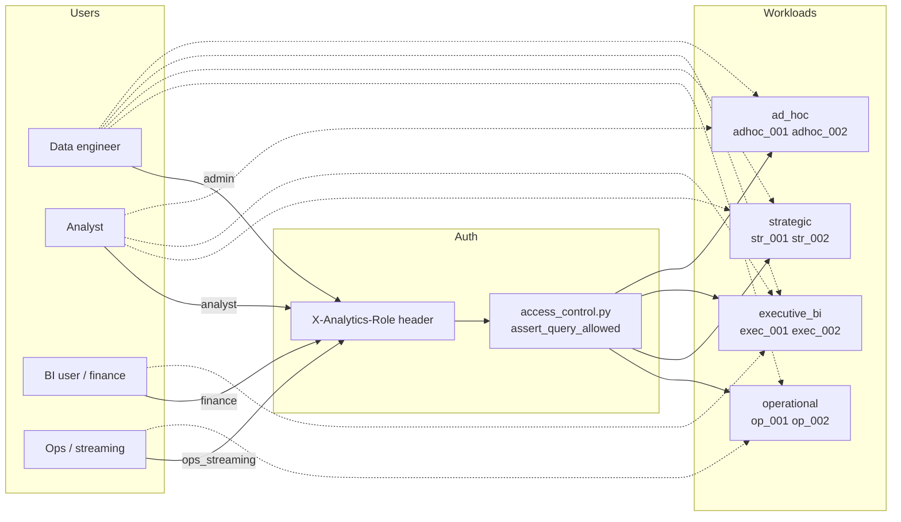

# Role-Based Access Control (RBAC)

**Use case:** Supply Chain Inventory Optimization  
**Implementation:** `control_plane/access_control.py` + governance policies `gov_access_001`, `gov_access_002`

---

## Is RBAC implemented?

**Yes — partially, at the Part 3 analytics layer.**

| Area | RBAC status | Mechanism |
|------|-------------|-----------|
| **Part 3 SQL workloads** | **Enforced** | HTTP header `X-Analytics-Role` on `POST /analytics/query/{query_id}` |
| **Part 3 governance docs** | Documented | `governance_policies.py` defines intended layer rules |
| **Part 1–2 ingestion API** | **Not role-based** | Single shared `API_TOKEN` (Bearer) for all operators |
| **Grafana dashboards** | **Not role-based** | Open on port 3000 in dev stack; production would use Grafana org roles |
| **Airflow / dbt / compaction** | **Not role-based** | Service accounts (Docker); data engineers use Airflow admin login |
| **Bronze 24h window** | **Policy helper only** | `check_bronze_access_window()` exists; not wired into every DuckDB query yet |

Default behaviour: if `X-Analytics-Role` is **omitted**, analytics-service treats the caller as **`analyst`**.

Production note: roles are **header-simulated** for reproducibility in the academic environment. A real deployment would map OAuth2/JWT claims → `AnalyticsRole`.

---

## Personas → system roles

| Persona | Maps to `AnalyticsRole` | Primary goal |
|---------|-------------------------|--------------|
| **Data engineer** | `admin` | Build pipelines, run all workloads, dbt, compaction, full catalog |
| **Analyst** | `analyst` | Strategic + executive + ad hoc SQL over Silver/Gold (no raw Bronze ops) |
| **BI user (executive)** | `finance` | KPI scorecards only — replenishment risk, PKR exposure, no exploratory joins |
| **BI user (operations)** | `ops_streaming` | Near-real-time shelf stock, bottlenecks, 24h streaming window |
| *(platform)* | `admin` | Same as data engineer for analytics API |

There is no separate enum value for `data_engineer` or `bi_user` in code — use the mappings above.

---

## Layer access matrix

Legend: **R** read/query · **W** write/mutate · **—** blocked · **(P)** policy intent, not fully enforced in SQL engine

### Lakehouse layers (Iceberg)

| Layer | Tables (examples) | Data engineer | Analyst | BI user (finance) | BI user (ops) |
|-------|-------------------|---------------|---------|-------------------|---------------|
| **Bronze** | `bronze.*` per source | **R/W** (ingestion, Airflow) | **— (P)** | **—** | **R** 24h window only `(P)` |
| **Silver** | `silver.warehouse_master`, `silver.iot_rfid_stream`, … | **R/W** (transform-service) | **R** | **R** aggregates `(P)` | **R** operational joins |
| **Gold** | `gold.replenishment_signals` | **R/W** (GoldAggregator) | **R** | **R** (exec KPIs) | **R** via operational SQL |
| **Semantic parquet** | `storage/semantic/parquet/*` | **R/W** (export, dbt) | **R** (via marts) | **R** (exec marts) | **R** (limited) |
| **dbt marts** | `fct_replenishment_signals`, `fct_daily_revenue`, … | **R/W** (dbt run) | **R** | **R** | **R** (operational facts) |

### Workload types (8 SQL queries)

| Workload | Query IDs | Data engineer | Analyst | BI (finance) | BI (ops) |
|----------|-----------|---------------|---------|--------------|----------|
| Operational | `op_001`, `op_002` | Yes | No | No | **Yes** |
| Strategic | `str_001`, `str_002` | Yes | **Yes** | No | No |
| Executive BI | `exec_001`, `exec_002` | Yes | **Yes** | **Yes** (`exec_001`, `exec_002` only) | No |
| Ad hoc | `adhoc_001`, `adhoc_002` | Yes | **Yes** | No | No |

Enforcement code (`access_control.py`):

```python
_ROLE_WORKLOADS = {
    "admin":         {"operational", "strategic", "executive_bi", "ad_hoc"},
    "analyst":       {"strategic", "executive_bi", "ad_hoc"},
    "finance":       {"executive_bi"},  # + query_id in {exec_001, exec_002}
    "ops_streaming": {"operational"},
}
```

### APIs & UIs

| Interface | Port | Data engineer | Analyst | BI (finance) | BI (ops) |
|-----------|------|---------------|---------|--------------|----------|
| Ingestion API (`api.py`) | 8000 | **API_TOKEN** | **API_TOKEN** | — | — |
| Ingestion dashboard | 8000/dashboard | **API_TOKEN** | **API_TOKEN** | read-only `(P)` | read-only `(P)` |
| transform-service | 8001 | internal / Airflow | — | — | — |
| analytics-service catalog | 8002 | open GET | open GET | open GET | open GET |
| `POST /analytics/query/{id}` | 8002 | `admin` | `analyst` | `finance` | `ops_streaming` |
| `POST /analytics/run-all` | 8002 | **no RBAC** (runs all 8) | same | same | same |
| `GET /semantic/bi-kpis` | 8002 | open GET | open GET | open GET | open GET |
| `POST /semantic/dbt/run` | 8002 | **no RBAC** (dev) | — | — | — |
| Grafana Executive BI | 3000 | open (dev) | open (dev) | open (dev) | open (dev) |
| Airflow UI | 8080 | admin login | — | — | — |

---

## RBAC flow (Part 3 analytics)



---

## Example API calls

### Data engineer — run any query

```bash
curl -X POST "http://localhost:8002/analytics/query/adhoc_001" \
  -H "X-Analytics-Role: admin"
```

### Analyst — strategic trend (allowed)

```bash
curl -X POST "http://localhost:8002/analytics/query/str_001" \
  -H "X-Analytics-Role: analyst"
```

### Analyst — operational query (denied → 403)

```bash
curl -X POST "http://localhost:8002/analytics/query/op_001" \
  -H "X-Analytics-Role: analyst"
# {"detail":"Role 'analyst' cannot run workload 'operational' per data access policy gov_access_001"}
```

### BI user (finance) — executive scorecard (allowed)

```bash
curl -X POST "http://localhost:8002/analytics/query/exec_001" \
  -H "X-Analytics-Role: finance"
```

### BI user (finance) — ad hoc blocked

```bash
curl -X POST "http://localhost:8002/analytics/query/adhoc_002" \
  -H "X-Analytics-Role: finance"
# 403 — finance restricted to exec_001 / exec_002
```

### Ops streaming — current inventory (allowed)

```bash
curl -X POST "http://localhost:8002/analytics/query/op_001" \
  -H "X-Analytics-Role: ops_streaming"
```

### Analytics dashboard (browser)

Open http://localhost:8002/dashboard → select role from dropdown → **Run all SQL workloads** sends the chosen header (only single-query POST is RBAC-checked today).

---

## Governance policy alignment

| Policy | Rule summary | RBAC hook |
|--------|--------------|-----------|
| `gov_access_001` | Role-based lakehouse access by layer | `_ROLE_WORKLOADS`, `assert_query_allowed` |
| `gov_access_002` | Bronze streaming 24h for ops; no Bronze joins for BI | `check_bronze_access_window`, ops_streaming role |
| `gov_cost_001` | Ad hoc join limits in business hours | `query_executor.enforce_cost_policy` (all roles) |

---

## What each persona typically does in this project

### Data engineer
- Run `docker compose` stacks, Airflow DAGs (ingestion, transformation, compaction, semantic)
- Write to Bronze/Silver/Gold via transform-service and ingestion-api
- Run dbt, export semantic parquet, `POST /analytics/run-all` with `admin`
- Monitor workload dashboard in Grafana

### Analyst
- Query Silver/Gold via strategic and ad hoc workloads (`analyst` role)
- Use executive KPIs for replenishment reports
- Read analytics catalog and metrics; no operational near-real-time queries

### BI user (executive / finance)
- Grafana **Supply Chain Executive BI** (SKUs at risk, urgency, PKR, weather)
- `GET /semantic/bi-kpis` or `POST /analytics/query/exec_001` with `finance`
- No ad hoc cross-source investigation (PII / cost policy)

### BI user (operations)
- Operational dashboards: shelf stock (`op_001`), bottlenecks (`op_002`)
- `ops_streaming` role; Bronze access limited to 24h by policy
- Ingestion dashboard for pipeline health (with API token)

---

## Gaps & production hardening

1. **`POST /analytics/run-all`** bypasses RBAC — use single-query POST for demos, or restrict run-all to `admin` in production.
2. **GET endpoints** (bi-kpis, catalog, governance) are unauthenticated in dev.
3. **Layer filtering** (hide Bronze columns in DuckDB) is policy-documented but not row/column-masked in SQL.
4. **Grafana** should use org roles + datasource permissions.
5. **Ingestion API** should evolve from single token to scoped service accounts per team.

---

## Related files

| File | Purpose |
|------|---------|
| `control_plane/access_control.py` | Role enum + enforcement |
| `control_plane/governance_policies.py` | Policy definitions |
| `analytics_service.py` | `Depends(resolve_role)` on query POST |
| `data_plane/analytics/query_executor.py` | Calls `assert_query_allowed` |
| `data_plane/analytics/analytics_dashboard.html` | Role selector UI |

See also: `ARCHITECTURE.md` (four-plane diagram), `PROJECT_PART3_REPORT.md` §2.2.
